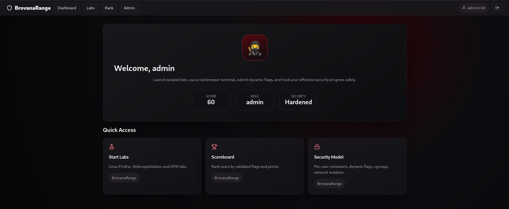
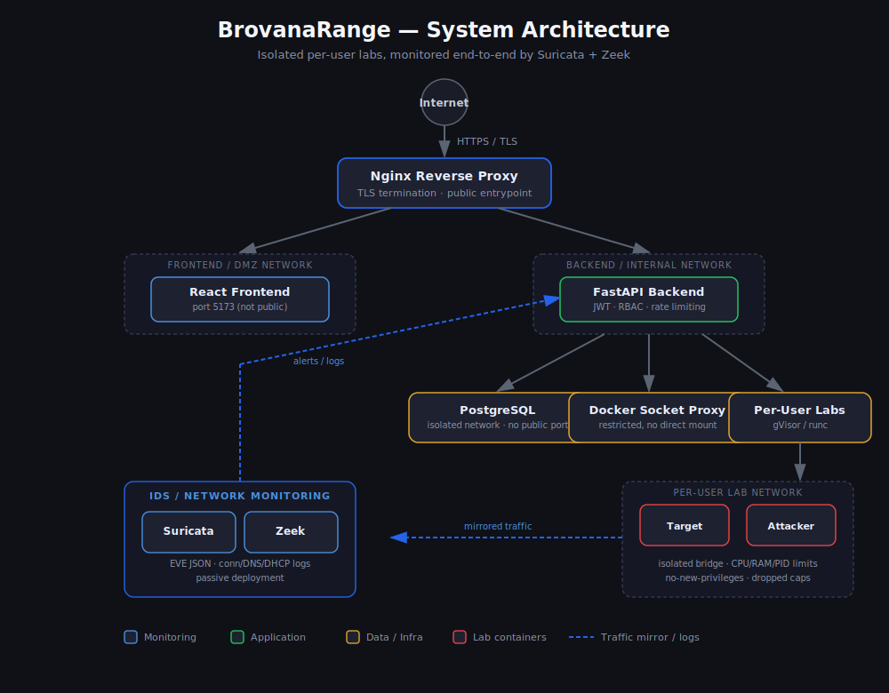

# BrovanaRange

> A self-hosted, multi-tenant cyber range for offensive security training — isolated per-user labs, real-time IDS monitoring, and a defense-in-depth security architecture built from the ground up.


## Demo



## What is BrovanaRange?

BrovanaRange is an open-source cyber range platform that lets users spin up isolated, containerized labs to practice offensive security — web exploitation, privilege escalation, and forensics — while every action is monitored by a real IDS stack (Suricata + Zeek). It's built like a production platform, not a toy: JWT auth with MFA, RBAC, rate limiting, audit logging, and an anti-cheat system that detects flag sharing and automated solving.

## Key Features

- 🔒 **Per-user isolated lab environments** — each session runs in its own Docker container with dedicated networking, auto-expiry, and resource limits
- 🛡️ **Real IDS/network monitoring** — Suricata + Zeek deployed to inspect lab traffic, with EVE JSON logging and custom detection rules
- 🔑 **Hardened authentication** — JWT + rotating refresh tokens, Argon2 password hashing, TOTP MFA, email OTP, account lockout
- 🚦 **Anti-cheat system** — detects fast-solve bursts, IP reuse, and cross-user flag sharing
- 📊 **Full observability** — audit logs, Prometheus metrics endpoint, admin dashboards for sessions/containers/anti-cheat events
- 🌐 **Network segmentation** — separate Docker networks for frontend/DMZ, backend, database, and per-user labs, all sitting behind an Nginx reverse proxy with TLS

## Architecture



Traffic flows through Nginx (TLS termination) into segmented Docker networks — frontend/DMZ, backend/internal, database, and per-user lab networks are all isolated from each other. Every lab session's traffic is mirrored to Suricata and Zeek for real-time detection, with alerts and logs feeding back into the backend for the admin dashboard and audit trail.

## Tech Stack

| Layer | Technology |
|---|---|
| Frontend | React |
| Backend | FastAPI |
| Database | PostgreSQL |
| Containerization | Docker, Docker Compose |
| Reverse Proxy | Nginx (TLS termination) |
| IDS / Monitoring | Suricata, Zeek |
| Auth | JWT, Argon2, TOTP MFA |
| Metrics | Prometheus-compatible `/metrics` |

## HTTP Honeypot

BrovanaRange includes a standalone, low-interaction HTTP honeypot for capturing opportunistic scans and authentication attempts. It listens on host port `8081`, returns decoy responses for common targets such as `/admin` and `/phpmyadmin`, and records JSON events to its Docker logs. It is isolated on a dedicated internal network with no access to the application, database, Docker socket, lab networks, or persistent data.

Run and monitor it with:

```bash
docker compose up -d --build honeypot
docker compose logs -f honeypot
```

Deployment and safety details are in [`honeypot/README.md`](honeypot/README.md).

## Included Labs

| Lab | Focus | What the learner does |
|---|---|---|
| Linux Privilege Escalation | Linux | Enumerates a sudo misconfiguration and recovers a dynamic root flag. |
| Red Injection | Web exploitation | Exploits a vulnerable local service and recovers a dynamic flag. |
| Skeleton DFIR | Digital forensics | Investigates a compromised container and its evidence. |

## Security Architecture

BrovanaRange is designed with a defense-in-depth approach across every layer:

<details>
<summary><b>Network Security</b></summary>

- HTTPS/TLS via Nginx, HTTP→HTTPS redirect
- Backend, frontend, and database ports never exposed publicly
- Docker network segmentation: separate frontend/DMZ, backend, database, and per-user lab networks
- UFW firewall with default-deny inbound policy
- Attack surface verified via Nmap scans
</details>

<details>
<summary><b>Container Security</b></summary>

- Isolated Docker container per lab session, per user
- Auto-expiring sessions with automatic cleanup
- `no-new-privileges`, dropped Linux capabilities by default
- CPU/RAM/PID limits enforced per container
- gVisor (runsc) sandboxing support; `runc` only where privilege-escalation labs require it
- No host folders mounted into lab containers; Docker socket never mounted directly into backend
</details>

<details>
<summary><b>Authentication & Authorization</b></summary>

- JWT access tokens + rotating refresh tokens, logout/logout-all session revocation
- Argon2 password hashing (legacy bcrypt verification supported)
- TOTP MFA and email OTP challenge support
- Account lockout after repeated failed logins
- Role-based access control (RBAC), admin APIs restricted by role
- Session/terminal ownership verification — users can't touch each other's labs
</details>

<details>
<summary><b>Rate Limiting & Anti-Abuse</b></summary>

- Rate limiting on login, registration, lab start, and flag submission
- Mitigates brute-force, automated flag guessing, and resource exhaustion
</details>

<details>
<summary><b>Anti-Cheat System</b></summary>

- Detects fast-solve bursts, suspicious IP reuse, and cross-user flag reuse
- Flags are dynamic and per-session, hashed before validation, redacted in storage
- Admin dashboard for anti-cheat events
</details>

<details>
<summary><b>IDS & Network Monitoring</b></summary>

- Suricata deployed in Docker, monitoring lab network traffic with EVE JSON + fast.log alerting
- Custom detection rules (ICMP, HTTPS traffic)
- Zeek generating connection, DNS, DHCP, and anomaly logs
</details>

<details>
<summary><b>Monitoring & Observability</b></summary>

- Full audit logging: auth events, lab lifecycle, flag submissions, admin actions
- Prometheus-compatible `/metrics` endpoint
- Admin dashboards for sessions, containers, and audit logs
</details>

Full security architecture writeup: [`docs/SECURITY.md`](docs/SECURITY.md)

## Quick Start

```bash
git clone https://github.com/Aymwvn/BrovanaRange.git
cd BrovanaRange
cp .env.example .env
# edit .env with your own secrets before starting

docker-compose up --build
```

Frontend will be available at `https://localhost` (self-signed cert on first run).

## Project Structure

```
BrovanaRange/
├── backend/          # FastAPI app (auth, labs, API)
├── frontend/         # React dashboard
├── ids/              # Suricata + Zeek configs/rules
├── docs/
│   ├── SECURITY.md   # Full security architecture doc
│   └── screenshots/
├── docker-compose.yml
├── .env.example
├── LICENSE
└── README.md
```

## Roadmap

- [ ] Automatic IPS blocking (currently passive IDS)
- [ ] SIEM integration + centralized logging dashboards
- [ ] WAF deployment
- [ ] Kubernetes network policies / cloud security groups
- [ ] Firecracker/Kata microVM isolation for labs
- [ ] Trusted public TLS certificates for production deploys

## License

MIT — see [LICENSE](LICENSE)

## Author

**Aymane Boualam** — [github.com/Aymwvn](https://github.com/Aymwvn)
